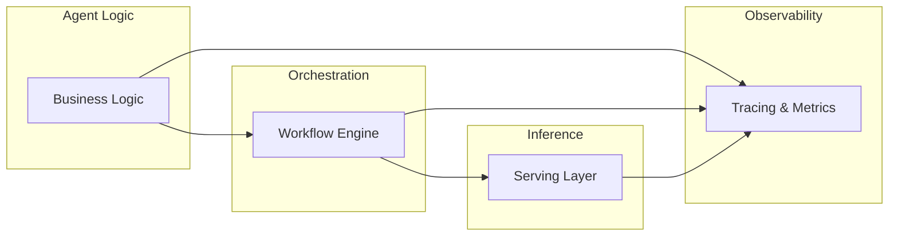

2025 was the year AI moved from "impressive demos" to "production reality."

The hype cycle of 2023-2024 gave way to hard engineering problems. Teams discovered that making AI agents work reliably, cost-effectively, and at scale required rethinking infrastructure from the ground up.

Here's what we learned.

## The Big Themes

### 1. The Durability Awakening

**What happened**: Teams discovered that agent frameworks optimized for demos failed spectacularly in production. Lost state, partial completions, and "just retry from scratch" became unacceptable.

**The shift**: Temporal-based orchestration, event sourcing, and durable execution patterns moved from "nice to have" to mandatory. Frameworks that couldn't guarantee execution continuity started losing ground.

**Winners**: Infrastructure that treated reliability as foundational, not bolted-on.

### 2. Memory Goes Production

**What happened**: Mem0, Letta, and Zep graduated from research projects to production infrastructure. The [LoCoMo benchmark](https://arxiv.org/abs/2504.19413) gave teams objective ways to evaluate memory systems.

**Key milestone**: Mem0 achieving 87%+ accuracy on long-term memory tasks while remaining self-hostable.

**The insight**: Memory isn't just RAG with extra steps—it's a fundamentally different approach to context management.

### 3. The Microsoft Consolidation

**What happened**: Microsoft merged AutoGen and Semantic Kernel into the Microsoft Agent Framework, signaling enterprise AI is now a platform play, not a library choice.

**Implications**:

- Azure lock-in concerns intensified
- Multi-cloud teams scrambled for alternatives
- Open-source alternatives gained urgency

**Timeline**: GA expected Q1 2026 with deprecation of standalone AutoGen.

### 4. Observability Becomes Non-Negotiable

**What happened**: [Langfuse went fully MIT](/blog/observability-driven-ai) in June, open-sourcing commercial features. Helicone crossed 2 billion traced interactions.

**The pattern**: "We can't debug it" became unacceptable. Teams demanded tracing, evaluation, and cost tracking as baseline capabilities.

**Standard stack**: Langfuse/Helicone for LLM tracing + Prometheus for infrastructure metrics + custom dashboards for business KPIs.

### 5. Gateway Wars Intensified

**What happened**: LiteLLM, Portkey, Kong AI, and Bifrost competed for the "traffic controller" role between applications and LLM providers.

**Key benchmark**: Kong AI Gateway proved 859% faster than LiteLLM, reshaping expectations for what gateways should deliver.

**The insight**: Gateways aren't commodity infrastructure—they're competitive advantage.

## What Worked

### ✅ Event-Sourced State Management

Teams that adopted event sourcing for agent state reported:

- 90%+ reduction in "lost work" incidents
- Complete audit trails for compliance
- Ability to replay and debug any workflow

### ✅ Separation of Concerns

The winning architecture pattern:

Each layer does one thing well. Mixing concerns created maintenance nightmares.

### ✅ Self-Hosted Inference for Scale

Teams processing over 1M tokens/day saved 40-60% by moving to self-hosted vLLM/TGI instead of API providers. The operational overhead paid for itself within months.

### ✅ Hybrid Memory Architectures

Combining semantic memory (embeddings) with episodic memory (conversation history) and procedural memory (learned workflows) outperformed single-approach systems consistently.

## What Didn't Work

### ❌ "All-in-One" Agent Frameworks

Frameworks that tried to do everything—orchestration, memory, inference, observability—became maintenance burdens. Teams learned to compose specialized tools instead.

### ❌ Synchronous-Only Architectures

Agents that blocked on every LLM call couldn't scale. Async-first, streaming architectures became mandatory for production workloads.

### ❌ Ignoring Cost Until Production

Teams that optimized purely for capability in development faced 10x budget overruns in production. Cost-aware design from day one became best practice.

### ❌ Treating Agents Like Traditional Software

"Deploy and forget" doesn't work for AI. Continuous evaluation, prompt versioning, and model regression testing are operational requirements, not optional.

## By The Numbers

| Metric                         | Early 2025 | Late 2025   |
| ------------------------------ | ---------- | ----------- |
| Average agent workflow length  | 3-5 steps  | 15-20 steps |
| Acceptable failure rate        | 10-15%     | Under 2%    |
| Time to production             | 6+ months  | 6-8 weeks   |
| Self-hosted inference adoption | 15%        | 40%         |
| Observability coverage         | Optional   | Mandatory   |

## 2026 Predictions

### Prediction 1: Durability Becomes Table Stakes

Every serious agent framework will offer durable execution by end of 2026. Teams won't evaluate frameworks that can't survive restarts.

### Prediction 2: Memory Consolidation

The memory framework space (currently 6+ major players) will consolidate to 2-3 clear winners. Expect acquisitions and deprecated projects.

### Prediction 3: Edge AI Agents

With llama.cpp improvements and quantization advances, expect agents running locally on laptops and phones. Privacy-sensitive use cases will drive adoption.

### Prediction 4: Regulatory Clarity

EU AI Act enforcement will drive standardization around:

- Audit logging requirements
- Human oversight mechanisms
- Explainability standards

Frameworks that build compliance in will have advantages.

### Prediction 5: Multi-Agent Goes Mainstream

2025 was experimentation. 2026 will see production multi-agent systems handling real workloads—with proper orchestration, not ad-hoc coordination.

## Where DuraGraph Fits

Looking back at 2025, the thesis behind [DuraGraph](/docs/introduction) proved out:

1. **Durability matters**: Teams need Temporal-grade reliability for AI workflows
2. **Compatibility eases adoption**: LangGraph-compatible API reduced migration friction
3. **Self-hosted is essential**: Enterprises won't trust critical AI to third-party clouds
4. **Observability is foundational**: Event sourcing enables debugging, not just logging

As 2026 approaches, we're doubling down on:

- Enhanced multi-agent orchestration patterns
- Deeper memory system integrations
- Expanded observability capabilities
- Performance optimizations for high-throughput scenarios

The infrastructure layer for AI is still being built. We're grateful to be part of that construction.

## Thank You

To everyone who tried DuraGraph in 2025, filed issues, contributed code, or just asked hard questions—thank you. The AI infrastructure of tomorrow is being built by this community.

Here's to an even more productive 2026.

## Resources

- [DuraGraph Documentation](/docs/introduction)
- [2025 Blog Archive](/blog)
- [GitHub Repository](https://github.com/duragraph/duragraph)
- [Community Discord](https://discord.gg/duragraph)
