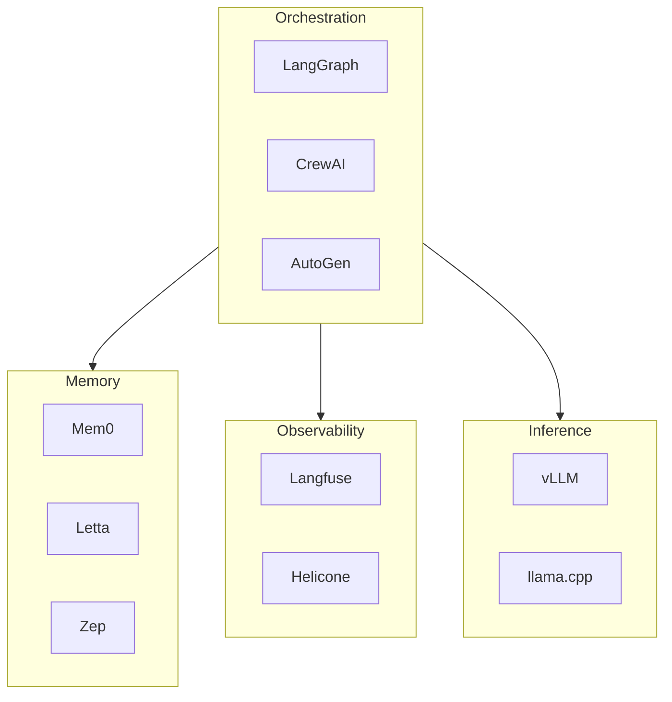

import { Card, CardGrid } from '@astrojs/starlight/components';
import { Tabs, TabItem } from '@astrojs/starlight/components';
import { Aside } from '@astrojs/starlight/components';

The AI agent landscape has evolved rapidly. Here's our analysis of the major frameworks and what they mean for developers building production AI systems.

## The Big Picture



## Framework Comparison

<CardGrid>
  <Card title="LangGraph" icon="puzzle">
    Graph-based state machines with explicit control flow. Best for complex workflows requiring
    fine-grained state management.
  </Card>
  <Card title="CrewAI" icon="rocket">
    Role-based multi-agent collaboration. Powers 60% of Fortune 500 AI deployments with its
    intuitive crew metaphor.
  </Card>
  <Card title="AutoGen" icon="seti:config">
    Microsoft's message-passing architecture. Merging with Semantic Kernel for Q1 2026 GA.
  </Card>
  <Card title="Haystack" icon="magnifier">
    Pipeline-based NLP from deepset. Excels at search, RAG, and document processing workflows.
  </Card>
</CardGrid>

## When to Use Each

<Tabs>
  <TabItem label="LangGraph">
    **Choose LangGraph when:**
    - You need explicit state machine control
    - Complex branching logic is required
    - You want LangChain ecosystem integration

    ```python
    from langgraph.graph import StateGraph

    graph = StateGraph(AgentState)
    graph.add_node("research", research_agent)
    graph.add_node("write", writing_agent)
    graph.add_edge("research", "write")
    ```

  </TabItem>
  <TabItem label="CrewAI">
    **Choose CrewAI when:**
    - Tasks map naturally to roles (researcher, writer, reviewer)
    - You want quick prototyping (ship in under 2 weeks)
    - Sequential or hierarchical execution fits your use case

    ```python
    from crewai import Agent, Crew, Task

    researcher = Agent(role="Researcher", goal="Find data")
    crew = Crew(agents=[researcher], tasks=[...])
    ```

  </TabItem>
  <TabItem label="AutoGen">
    **Choose AutoGen when:**
    - You need auditable, observable agent interactions
    - Human-in-the-loop is critical
    - You're building for Azure/enterprise environments

    ```python
    from autogen import AssistantAgent, UserProxyAgent

    assistant = AssistantAgent("assistant")
    user = UserProxyAgent("user")
    ```

  </TabItem>
</Tabs>

<Aside type="tip" title="DuraGraph Advantage">
  DuraGraph provides LangGraph Cloud compatibility with self-hosted reliability. Migrate your
  existing LangGraph workflows seamlessly while gaining Temporal-backed durability.
</Aside>

## Key Developments in 2025

### Microsoft Agent Framework

The biggest news is Microsoft merging AutoGen with Semantic Kernel into a unified **Microsoft Agent Framework**:

- **GA Expected**: Q1 2026
- **Languages**: C#, Python, Java
- **Features**: Production SLAs, multi-language support, deep Azure integration

This signals enterprise commitment to standardized agent development.

### CrewAI Enterprise Growth

CrewAI raised $18M and now powers agents for 60% of Fortune 500 companies. However, its opinionated design can be limiting as requirements grow beyond sequential/hierarchical execution.

### Haystack Voice Support

Haystack Agents now extend multimodal capabilities to support both text and voice workflows, positioning it for the growing voice-first agent market.

## Our Recommendations

| Use Case                         | Recommendation                     |
| -------------------------------- | ---------------------------------- |
| Quick prototype with clear roles | CrewAI                             |
| Complex stateful workflows       | LangGraph or **DuraGraph**         |
| Enterprise with Azure            | Wait for Microsoft Agent Framework |
| Search/RAG applications          | Haystack                           |
| Self-hosted production           | **DuraGraph**                      |

## Learn More

- [DuraGraph Introduction](/docs/introduction)
- [Migration from LangGraph](/docs/user-guide/tutorials/langgraph-migration)
- [Architecture Overview](/docs/architecture/overview)

## Sources

- [CrewAI vs AutoGen Comparison](https://oxylabs.io/blog/crewai-vs-autogen)
- [Top AI Agent Frameworks 2025](https://www.lindy.ai/blog/best-ai-agent-frameworks)
- [LangGraph vs AutoGen vs CrewAI](https://latenode.com/blog/platform-comparisons-alternatives/automation-platform-comparisons/langgraph-vs-autogen-vs-crewai-complete-ai-agent-framework-comparison-architecture-analysis-2025)
- [CrewAI GitHub](https://github.com/joaomdmoura/crewAI)
- [AutoGen GitHub](https://github.com/microsoft/autogen)
