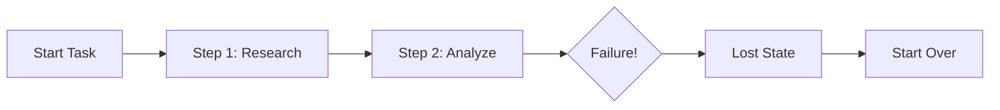
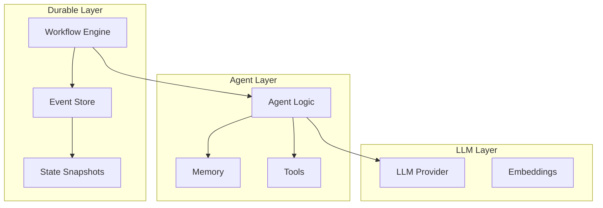

The AI industry has a dirty secret: most agent frameworks weren't built for production.

We've all seen the impressive demos—agents booking flights, writing code, orchestrating complex multi-step tasks. But ask anyone who's tried to run these in production and you'll hear the same stories: random failures, lost state, impossible debugging, and the dreaded "it worked on my laptop."

## The Reliability Gap

Consider what happens when a typical AI agent fails mid-execution:

With most frameworks, a network blip, an LLM timeout, or a simple process restart means starting from scratch. For a 10-minute workflow, that's frustrating. For a 2-hour enterprise pipeline processing thousands of documents? It's catastrophic.

## What Production AI Actually Needs

The patterns that make distributed systems reliable have been solved for decades. Database transactions, message queues, and workflow engines all share a common principle: **durable state**.

Temporal, the workflow engine born from Uber's Cadence project, pioneered durable execution for microservices. The core insight? Every step in a workflow should be:

1. **Persisted** - State survives process crashes
2. **Replayable** - Workflows resume exactly where they left off
3. **Observable** - Every state transition is logged and queryable
4. **Compensatable** - Failed steps can trigger cleanup logic

## Why This Matters for AI

AI workflows amplify traditional distributed systems challenges:

| Challenge        | Traditional Systems         | AI Workflows                                     |
| ---------------- | --------------------------- | ------------------------------------------------ |
| Execution time   | Milliseconds to seconds     | Minutes to hours                                 |
| State complexity | Structured data             | Unstructured + embeddings + conversation history |
| Failure modes    | Network, DB, service errors | + LLM timeouts, rate limits, hallucinations      |
| Cost of restart  | Low                         | High (LLM API costs, time, context loss)         |

When an agent is 45 minutes into analyzing a legal contract and hits an API rate limit, you can't afford to lose that progress.

## The Emerging Architecture Pattern

Forward-thinking teams are adopting what we call the "durable agent" pattern:

The key insight: separate the _what_ (agent logic) from the _how_ (execution guarantees). Your agent code stays clean and focused on business logic while the infrastructure handles:

- Automatic retries with exponential backoff
- State persistence across restarts
- Exactly-once execution semantics
- Full audit trail of every decision

## Real-World Impact

Teams adopting durable execution patterns report:

- **90%+ reduction** in failed workflow restarts
- **Complete audit trails** for compliance-heavy industries
- **Faster debugging** through event replay
- **Cost savings** from not re-running expensive LLM calls

## The Path Forward

The industry is at an inflection point. The frameworks that dominated the "agent demo" era aren't equipped for production workloads. We're seeing a shift toward infrastructure that treats reliability as a first-class concern.

This is exactly why we built [DuraGraph](/docs/introduction). By combining LangGraph's intuitive API with Temporal's battle-tested durability, we're bridging the gap between prototype and production. Your agent logic stays familiar, but now it runs on infrastructure designed for the real world.

The question isn't whether your AI workflows need durability—it's whether you'll build it yourself or use infrastructure purpose-built for the challenge.

## Further Reading

- [Temporal's Durable Execution Model](https://temporal.io/how-it-works)
- [DuraGraph Architecture Overview](/docs/architecture/overview)
- [Event Sourcing for AI Workflows](/docs/user-guide/concepts/workflows)
