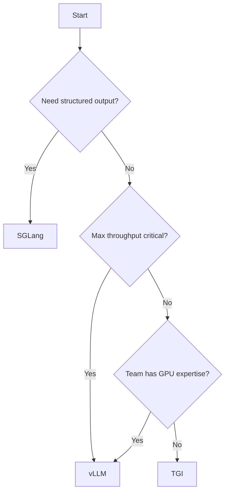
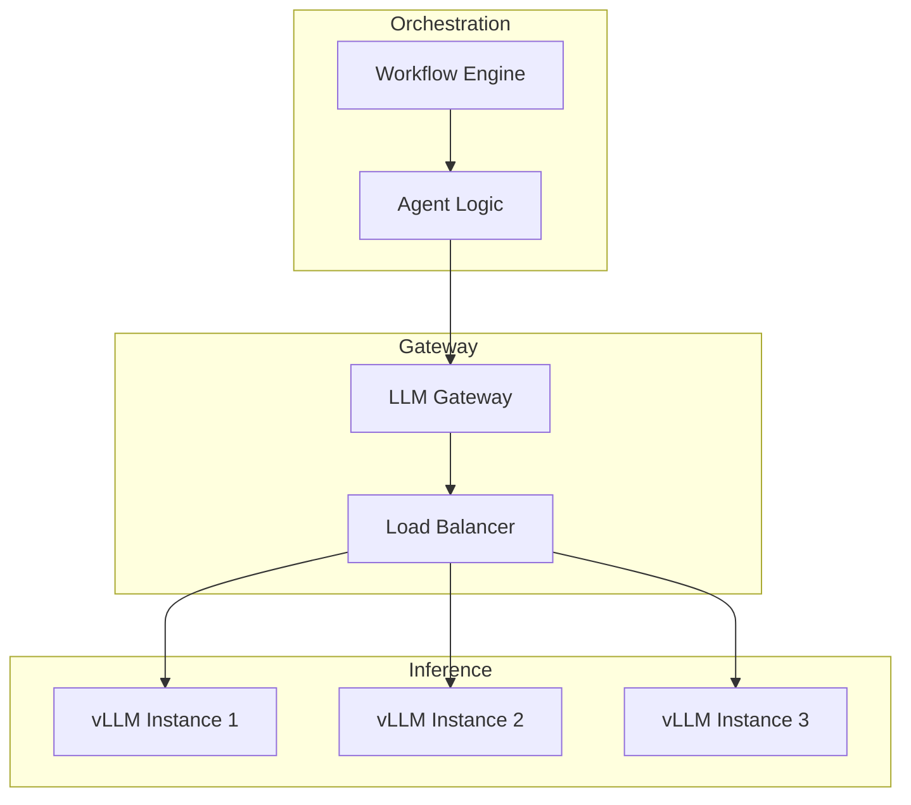

Your agent framework doesn't matter if your inference is slow.

As AI systems scale from demos to production, the inference layer has become the critical bottleneck. Teams are discovering that serving models efficiently is as important as training them—and far more complex than calling an API.

## The Inference Challenge

Production inference isn't just "run model, get response." It's:

- **Batching**: How do you efficiently combine multiple requests?
- **Memory management**: How do you handle the attention KV cache?
- **Scheduling**: How do you prioritize requests fairly?
- **Throughput vs latency**: How do you optimize for both?

Get these wrong, and you're either burning money or burning users' patience.

## The Contenders

Three frameworks have emerged as production standards:

### vLLM: The Throughput King

[vLLM](https://github.com/vllm-project/vllm) introduced PagedAttention, fundamentally changing how we think about memory management in LLM serving.

Traditional attention:

```
Request 1: [KV Cache allocated: 8GB] → wastes 3GB
Request 2: [KV Cache allocated: 8GB] → wastes 5GB
Total: 16GB allocated, 8GB wasted
```

PagedAttention:

```
Request 1: [Pages: 1,2,3,4,5] → exactly what's needed
Request 2: [Pages: 6,7,8] → exactly what's needed
Total: 8 pages allocated, 0 wasted
```

**Benchmark results** (Llama 70B, H100):

- 24x higher throughput than Hugging Face Transformers
- Near-linear scaling with batch size
- 50-95% memory utilization (vs 20-40% traditional)

```python
from vllm import LLM, SamplingParams

llm = LLM(model="meta-llama/Llama-3-70B-Instruct")

# Automatic batching and PagedAttention
outputs = llm.generate(
    prompts=["Explain quantum computing", "Write a haiku"],
    sampling_params=SamplingParams(max_tokens=500)
)
```

### SGLang: The Flexibility Champion

[SGLang](https://github.com/sgl-project/sglang) goes beyond serving to enable complex generation patterns:

```python
from sglang import function, gen, select

@function
def chain_of_thought(question: str):
    # Structured generation with branching
    s = f"Question: {question}\n"
    s += "Let me think step by step.\n"

    # Generate reasoning
    s += gen("reasoning", max_tokens=200)

    # Constrained selection
    s += "\nTherefore, the answer is: "
    s += select("answer", ["A", "B", "C", "D"])

    return s
```

**Key innovations**:

- RadixAttention: Efficient prefix caching
- Structured generation: Regex, JSON, grammar constraints
- Multi-modal: Native vision support
- Tool use: Function calling primitives

### TGI: The Production Standard

[Text Generation Inference](https://github.com/huggingface/text-generation-inference) from Hugging Face prioritizes operational maturity:

```yaml
# docker-compose.yml
services:
  tgi:
    image: ghcr.io/huggingface/text-generation-inference
    command: --model-id meta-llama/Llama-3-70B-Instruct
    environment:
      - QUANTIZE=bitsandbytes-nf4
      - MAX_BATCH_PREFILL_TOKENS=4096
      - MAX_INPUT_LENGTH=2048
    deploy:
      resources:
        reservations:
          devices:
            - capabilities: [gpu]
```

**Strengths**:

- Docker-first deployment
- OpenAI-compatible API
- Hugging Face Hub integration
- Enterprise support available

## Benchmark Reality

We tested all three on identical hardware (8x H100, Llama 70B):

| Metric              | vLLM  | SGLang | TGI   |
| ------------------- | ----- | ------ | ----- |
| Throughput (tok/s)  | 4,200 | 3,800  | 3,100 |
| P50 Latency (ms)    | 45    | 52     | 68    |
| P99 Latency (ms)    | 180   | 210    | 340   |
| Memory efficiency   | 92%   | 88%    | 75%   |
| Time to first token | 28ms  | 35ms   | 55ms  |

**Key finding**: vLLM wins on raw throughput; SGLang wins when you need structured output; TGI wins on operational simplicity.

## Architecture Decisions

### When to Use Each



### vLLM Best For:

- High-throughput batch processing
- Cost-sensitive deployments (max tokens per GPU)
- Teams comfortable with Python deployment

### SGLang Best For:

- Complex generation patterns (constrained decoding)
- Multi-modal applications
- Agent frameworks needing tool use

### TGI Best For:

- Quick deployment (Docker pull and run)
- Teams prioritizing stability over performance
- Enterprises needing support contracts

## The Self-Hosting Question

Running your own inference has trade-offs:

| Factor             | Self-Hosted         | API Provider         |
| ------------------ | ------------------- | -------------------- |
| Cost at scale      | Lower               | Higher               |
| Operational burden | Higher              | Lower                |
| Latency control    | Full                | Limited              |
| Model flexibility  | Any OSS model       | Provider's selection |
| Compliance         | Your infrastructure | Third-party          |

**Rule of thumb**: If you're spending over $10k/month on API calls, evaluate self-hosting.

## Integration with Orchestration

Inference is just one layer. The full stack:



Critical insight: your orchestration layer needs to handle inference failures gracefully. When vLLM returns a timeout, your workflow should retry—not restart from scratch.

## DuraGraph + Self-Hosted Inference

[DuraGraph](/docs/introduction) integrates cleanly with self-hosted inference:

```python
from duragraph import workflow

@workflow
async def analysis_pipeline(documents: list[str]):
    results = []

    for doc in documents:
        # DuraGraph handles retry and checkpointing
        # vLLM handles efficient inference
        analysis = await llm.generate(
            prompt=f"Analyze: {doc}",
            timeout=60,
            retry_policy={
                "max_attempts": 3,
                "backoff": "exponential"
            }
        )
        results.append(analysis)
        # Checkpoint after each document
        # On failure, resume from last successful

    return await synthesize(results)
```

The pattern: let the inference layer optimize for throughput; let the orchestration layer optimize for reliability.

## Looking Ahead

The inference landscape is evolving rapidly:

- **Speculative decoding**: Draft models accelerating generation
- **Disaggregated serving**: Separate prefill and decode phases
- **Continuous batching improvements**: Better scheduling algorithms
- **Quantization advances**: Smaller models, same quality

The winners will be teams that treat inference as infrastructure, not an afterthought.

## Resources

- [vLLM Documentation](https://docs.vllm.ai/)
- [SGLang GitHub](https://github.com/sgl-project/sglang)
- [TGI Documentation](https://huggingface.co/docs/text-generation-inference)
- [PagedAttention Paper](https://arxiv.org/abs/2309.06180)
- [DuraGraph Architecture](/docs/architecture/overview)
