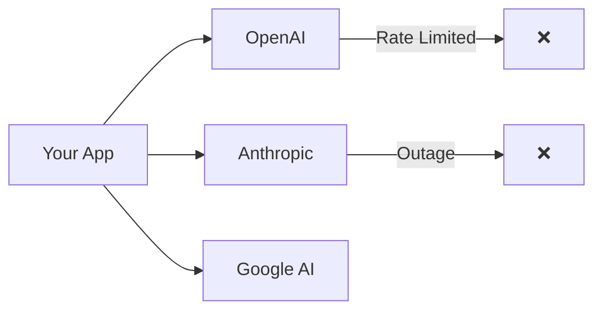
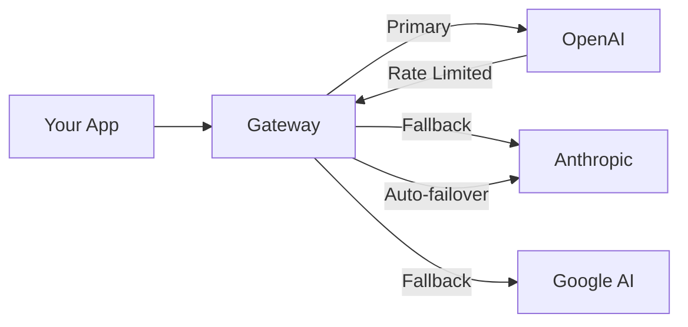
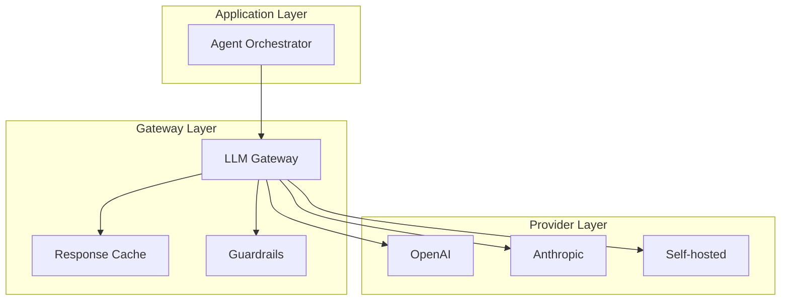

Six months ago, calling an LLM meant picking a provider and hitting their API. Today, production systems route through gateways that handle failover, caching, rate limiting, and cost optimization.

LLM gateways have quietly become the most important infrastructure decision in your AI stack.

## Why Gateways Matter

Without a gateway:



With a gateway:



The gateway handles the chaos so your application doesn't have to.

## The Contenders

We tested four production-grade gateways against the same workload: 5,000 concurrent requests across multiple models.

### LiteLLM

The Python-native choice, supporting 100+ LLM providers through a unified API.

```python
from litellm import completion

# Same API, any provider
response = completion(
    model="gpt-4o",  # or "claude-3-opus", "gemini-pro"
    messages=[{"role": "user", "content": "Hello"}],
    fallbacks=["claude-3-sonnet", "gemini-pro"],
    timeout=30
)
```

**Strengths**:

- Broadest model support
- Active open-source community
- Great for Python shops

**Weaknesses**:

- Python performance limitations
- Setup complexity for advanced features

### Portkey

Purpose-built for production AI, with 1,600+ model integrations and 40+ guardrails.

```typescript
import Portkey from 'portkey-ai';

const portkey = new Portkey({
  apiKey: 'PORTKEY_API_KEY',
  config: {
    retry: { attempts: 3, onStatusCodes: [429, 503] },
    cache: { mode: 'semantic', maxAge: 3600 },
  },
});

const response = await portkey.chat.completions.create({
  model: 'gpt-4o',
  messages: [{ role: 'user', content: 'Hello' }],
});
```

**Strengths**:

- Rich guardrails (PII detection, toxicity, etc.)
- Excellent dashboard
- Enterprise features

**Weaknesses**:

- Hosted solution adds latency
- Pricing can escalate

### Kong AI Gateway

The enterprise heavyweight, from the team behind Kong API Gateway.

```yaml
# Kong configuration
services:
  - name: ai-service
    url: http://ai-gateway:8000
    plugins:
      - name: ai-proxy
        config:
          route_type: llm/v1/chat
          model:
            provider: openai
            name: gpt-4o
          fallback_providers:
            - provider: anthropic
              model: claude-3-opus
```

**Strengths**:

- Enterprise-grade performance
- Existing Kong ecosystem
- Advanced rate limiting

**Weaknesses**:

- Complex setup
- Overkill for smaller deployments

### Bifrost (by Maxim)

The performance champion, written in Go for minimal overhead.

```go
// Bifrost adds <100µs overhead at 5k RPS
client := bifrost.NewClient(bifrost.Config{
    Providers: []string{"openai", "anthropic"},
    Strategy:  "latency-optimized",
})

response, _ := client.Chat(context.Background(), bifrost.ChatRequest{
    Model:    "auto",  // Routes to fastest available
    Messages: messages,
})
```

**Strengths**:

- Exceptional performance
- Minimal resource usage
- Open source

**Weaknesses**:

- Smaller ecosystem
- Fewer built-in features

## Benchmark Results

We ran each gateway through identical workloads:

| Gateway | Latency Overhead | Throughput (RPS) | Memory Usage |
| ------- | ---------------- | ---------------- | ------------ |
| Bifrost | Under 100µs      | 5,000+           | 50MB         |
| Kong AI | ~150µs           | 4,200            | 200MB        |
| Portkey | ~50ms            | 2,800            | N/A (hosted) |
| LiteLLM | ~200ms           | 1,200            | 400MB        |

_Tested on 12 CPU cores, same hardware for self-hosted solutions_

**Key finding**: Kong AI Gateway is 228% faster than Portkey and 859% faster than LiteLLM in sustained throughput tests.

## Feature Comparison

| Feature            | LiteLLM | Portkey    | Kong AI    | Bifrost |
| ------------------ | ------- | ---------- | ---------- | ------- |
| Model support      | 100+    | 1,600+     | 20+        | 10+     |
| Automatic failover | ✅      | ✅         | ✅         | ✅      |
| Semantic caching   | ✅      | ✅         | ✅         | ❌      |
| Guardrails         | Basic   | 40+        | Enterprise | Basic   |
| Rate limiting      | ✅      | ✅         | Advanced   | ✅      |
| Cost tracking      | ✅      | ✅         | ✅         | ✅      |
| Self-hosted        | ✅      | ✅         | ✅         | ✅      |
| Open source        | MIT     | Apache 2.0 | Commercial | MIT     |

## Choosing Your Gateway

### Use LiteLLM if:

- You're Python-native
- Need broadest model support
- Want simple, code-based configuration
- Building prototypes or small-scale production

### Use Portkey if:

- Guardrails are critical (PII, compliance)
- You want managed infrastructure
- Team needs visual dashboard
- Willing to pay for convenience

### Use Kong AI if:

- You're already using Kong
- Enterprise compliance requirements
- Need maximum throughput
- Have DevOps resources for setup

### Use Bifrost if:

- Performance is paramount
- Resources are constrained
- You want minimal dependencies
- Comfortable with Go ecosystem

## The Integration Question

Here's what most comparisons miss: your gateway choice affects your entire architecture.



A gateway is only useful if it integrates cleanly with your orchestration layer. When your agent workflow fails, you need visibility across both layers.

## DuraGraph Integration

[DuraGraph](/docs/introduction) works with any gateway, but we've optimized for common patterns:

```python
# DuraGraph workflow with gateway integration
from duragraph import workflow

@workflow
async def research_agent(query: str):
    # Gateway handles model selection and failover
    # DuraGraph handles execution durability
    response = await llm_call(
        prompt=query,
        # These map to gateway config
        fallback_models=["claude-3-sonnet", "gpt-4"],
        timeout=30
    )

    # If we fail here, DuraGraph replays from last checkpoint
    # Gateway handles the retry logic to providers
    analysis = await analyze(response)

    return analysis
```

The key insight: gateways handle provider-level reliability (failover, retries, caching), while DuraGraph handles workflow-level reliability (state persistence, execution replay, checkpointing).

Both layers are essential for production AI.

## Our Recommendation

For most teams:

1. **Start with LiteLLM** for development and prototyping
2. **Move to Portkey** when you need guardrails and dashboards
3. **Consider Kong/Bifrost** when throughput becomes critical

And regardless of gateway choice, ensure your execution layer handles failures that gateways can't—like workflows that span hours or days.

## Resources

- [LiteLLM Documentation](https://docs.litellm.ai/)
- [Portkey Gateway GitHub](https://github.com/Portkey-AI/gateway)
- [Kong AI Gateway](https://konghq.com/products/kong-ai-gateway)
- [Bifrost GitHub](https://github.com/maximhq/bifrost)
- [DuraGraph LLM Integration](/docs/api-reference/overview)
