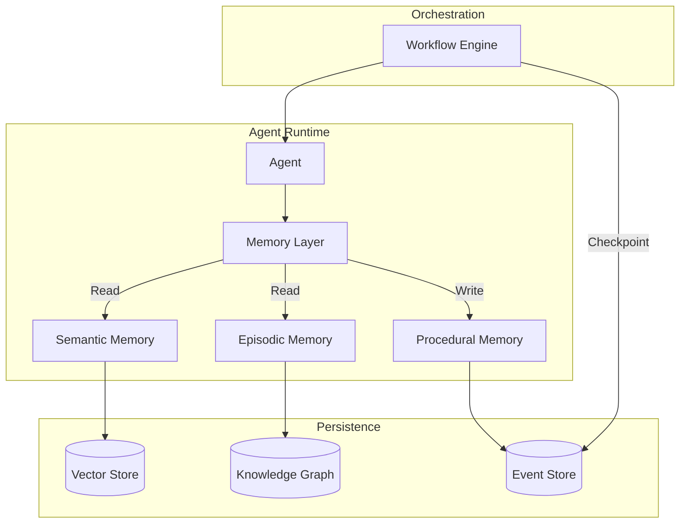

The most significant shift in AI agents this year isn't a new model—it's memory.

For years, agents operated like amnesiacs: brilliant in the moment, but starting fresh every conversation. That's finally changing. A new generation of memory frameworks is giving agents the ability to learn, remember, and build genuine context over time.

## The Memory Problem

Traditional RAG (Retrieval-Augmented Generation) treats memory as a search problem: embed documents, find relevant chunks, stuff them into context. It works for static knowledge bases but falls apart for:

- **User preferences** learned over time
- **Conversation history** across sessions
- **Task outcomes** and lessons learned
- **Relationship context** between entities

What agents need isn't just retrieval—it's memory that evolves.

## The New Memory Stack

Three frameworks have emerged as production-ready solutions, each with distinct approaches:

### Mem0: Graph-Based Memory

[Mem0](https://github.com/mem0ai/mem0) takes a graph-first approach, representing memories as nodes and relationships:

```python
from mem0 import Memory

memory = Memory()

# Memories are automatically extracted and linked
memory.add("User prefers Python over JavaScript", user_id="alice")
memory.add("User is building a trading bot", user_id="alice")

# Retrieval understands relationships
context = memory.search("What should I recommend for alice's project?")
# Returns: Python-based trading libraries, connected preferences
```

**Strengths**: Captures complex relationships, excellent for multi-entity scenarios
**Production at**: Mid-size deployments, AWS integration available

### Letta (formerly MemGPT): Infinite Context

[Letta](https://github.com/letta-ai/letta) solves memory through intelligent context management:

```python
from letta import Agent

agent = Agent(
    memory_human="User: Senior engineer, prefers concise responses",
    memory_persona="Assistant: Technical advisor for distributed systems"
)

# Context automatically compresses and expands
# Old memories are summarized, recent ones kept verbatim
response = agent.send_message("Continue our discussion on Kafka partitioning")
```

**Strengths**: Handles unlimited conversation length, built-in memory tiers
**Production at**: Enterprise deployments needing conversation continuity

### Zep: Temporal Knowledge Graphs

[Zep](https://github.com/getzep/zep) builds temporal knowledge graphs that understand how information changes over time:

```python
from zep_cloud.client import Zep

client = Zep(api_key="...")

# Memories are time-aware
client.memory.add(session_id="project-x", messages=[...])

# Query returns temporally-relevant context
# "What did we decide last week?" actually works
results = client.memory.search(
    session_id="project-x",
    text="project architecture decisions",
    search_scope="summary"
)
```

**Strengths**: SOC 2 compliant, temporal reasoning, enterprise-ready
**Production at**: Regulated industries, long-running projects

## Architecture Patterns

The winning pattern combines memory with durable orchestration:



Key insight: Memory operations should be part of your durable execution graph. When an agent learns something important, that memory write needs the same reliability guarantees as any other state change.

## What's Actually Working

After analyzing production deployments, patterns emerge:

| Use Case            | Best Approach | Why                                                           |
| ------------------- | ------------- | ------------------------------------------------------------- |
| Customer support    | Zep           | Temporal context crucial ("You called about this last month") |
| Code assistants     | Letta         | Long conversations, iterative refinement                      |
| Research agents     | Mem0          | Entity relationships between papers, concepts                 |
| Personal assistants | Hybrid        | User preferences (Mem0) + conversation (Letta)                |

## The Integration Challenge

Here's what the frameworks don't tell you: memory is only useful if it survives failures.

Consider this scenario:

1. Agent completes complex analysis
2. Extracts 5 key insights to memory
3. Process crashes before confirmation
4. On restart: Is memory saved? Partially? Which insights?

This is where durable execution becomes essential. [DuraGraph](/docs/introduction) treats memory writes as events in the workflow—either all memory operations in a step succeed together, or none do. Your agent's knowledge remains consistent even through failures.

## The Benchmark Reality

The [LoCoMo benchmark](https://arxiv.org/abs/2504.19413) tests long-context memory systems:

| Framework | Accuracy | Notes                          |
| --------- | -------- | ------------------------------ |
| memU      | 92%      | Hybrid retrieval approach      |
| Mem0      | 87%      | Graph relationships help       |
| Letta     | 84%      | Context compression trade-offs |
| Basic RAG | 61%      | Baseline comparison            |

Real-world performance varies significantly based on your domain and query patterns. Run your own evaluations.

## Looking Ahead

Memory is moving from "nice to have" to table stakes. OpenAI's memory features, Anthropic's context improvements, and Google's Project Astra all point the same direction: agents that remember.

The question for production teams: Do you build memory infrastructure yourself, or use purpose-built solutions? The answer increasingly is the latter—but with careful integration into your execution layer to ensure reliability.

## Resources

- [Mem0 Paper: Building Production-Ready AI Agents](https://arxiv.org/abs/2504.19413)
- [Memory in the Age of AI Agents Survey](https://arxiv.org/abs/2512.13564)
- [DuraGraph State Management](/docs/user-guide/concepts/workflows)
