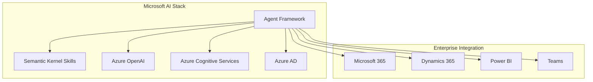

Microsoft just made its biggest move in the agent wars: merging AutoGen with Semantic Kernel into a unified **Microsoft Agent Framework**, with GA targeted for Q1 2026.

This isn't just a product announcement—it's a signal of where enterprise AI is heading. Let's break down what this means for teams building production agent systems.

## The Merger Explained

AutoGen and Semantic Kernel have been Microsoft's two approaches to AI orchestration:

| Aspect    | AutoGen                   | Semantic Kernel                   |
| --------- | ------------------------- | --------------------------------- |
| Origin    | Microsoft Research        | Azure AI team                     |
| Focus     | Multi-agent conversations | Plugin/skill orchestration        |
| Language  | Python-first              | Multi-language (C#, Python, Java) |
| Strength  | Research flexibility      | Enterprise integration            |
| Community | Academic, experimental    | Production, Azure-native          |

The merger combines AutoGen's sophisticated multi-agent patterns with Semantic Kernel's enterprise-grade foundations.

## What's Coming

Based on Microsoft's announcements and documentation previews:

### Unified API Surface

```python
# New unified approach (preview)
from microsoft.agents import Agent, Team, Orchestrator

researcher = Agent(
    name="researcher",
    model="gpt-4o",
    skills=[web_search, document_reader]
)

analyst = Agent(
    name="analyst",
    model="gpt-4o",
    skills=[data_analysis, chart_generator]
)

team = Team(agents=[researcher, analyst])
orchestrator = Orchestrator(team, strategy="hierarchical")

result = await orchestrator.run("Analyze Q3 market trends")
```

### Key Features

- **Multi-language support**: Write agents in Python, C#, or Java
- **Azure-native**: Deep integration with Azure AI services, KeyVault, managed identity
- **Production SLAs**: Enterprise support, uptime guarantees
- **Observability**: Built-in tracing, metrics, Azure Monitor integration
- **Human-in-the-loop**: First-class support for approval workflows

## The Enterprise Play

This move makes strategic sense for Microsoft:



Microsoft is betting that enterprises want agents that:

1. Integrate seamlessly with existing Microsoft infrastructure
2. Meet compliance requirements out of the box
3. Scale with enterprise support behind them

## What This Means for Teams

### If You're Using AutoGen

Current AutoGen code will continue to work through a compatibility layer. However:

- **New features** will land in the unified framework first
- **Migration path** is clear but not trivial
- **Timeline**: 12-18 months of parallel support, then deprecation

### If You're Using Semantic Kernel

You're better positioned. Semantic Kernel forms the foundation of the new framework:

- **Existing skills** port directly
- **Plugins architecture** is preserved
- **Breaking changes** minimal for core patterns

### If You're Evaluating Options

The merger creates both opportunity and risk:

**Opportunity**: Microsoft's commitment signals long-term support
**Risk**: Vendor lock-in to Azure ecosystem deepens

## The Lock-In Question

Here's the uncomfortable truth: the Microsoft Agent Framework will work best on Azure. Period.

Yes, you can run Semantic Kernel against OpenAI directly. Yes, the framework is technically open source. But the integration depth with Azure services—identity, secrets, monitoring, scaling—creates practical lock-in.

For teams that:

- **Already committed to Azure**: This is great news
- **Multi-cloud or cloud-agnostic**: Evaluate carefully
- **Self-hosted requirements**: Look elsewhere

## What's Missing

Despite the impressive feature set, gaps remain:

### Durability

Microsoft's framework inherits Semantic Kernel's execution model: primarily stateless with manual checkpointing. For long-running workflows:

```python
# You'll need to handle this yourself
async def research_workflow(query):
    # Step 1 - no automatic state persistence
    research = await researcher.run(query)
    # If we crash here, research is lost

    # Step 2
    analysis = await analyst.run(research)
    # Same problem

    return analysis
```

There's no equivalent to Temporal's durable execution or event sourcing. For mission-critical workflows, this remains a gap.

### Portability

The framework deeply assumes Azure primitives. Self-hosting means reimplementing:

- Secret management (Azure KeyVault replacement)
- Identity (Azure AD replacement)
- Monitoring (Azure Monitor replacement)
- Scaling (Azure Container Apps replacement)

## Where DuraGraph Fits

This is where DuraGraph's approach differs fundamentally:

| Concern           | Microsoft Agent Framework      | DuraGraph                         |
| ----------------- | ------------------------------ | --------------------------------- |
| Execution model   | Stateless + manual checkpoints | Durable execution, automatic      |
| Cloud dependency  | Azure-native                   | Cloud-agnostic, self-hosted       |
| State persistence | Application responsibility     | Infrastructure guarantee          |
| Failure recovery  | Retry logic in code            | Automatic replay from event store |

Teams building on DuraGraph can integrate Microsoft's agents as execution nodes while maintaining durability guarantees the framework itself doesn't provide.

## The Bigger Picture

Microsoft's consolidation reflects industry maturation. The experimental phase of "let's see what agents can do" is transitioning to "let's make agents reliable in production."

But Microsoft's solution optimizes for their ecosystem. For teams needing:

- **Self-hosted deployments**
- **Multi-cloud flexibility**
- **Durable execution guarantees**
- **LangGraph compatibility**

The answer lies in infrastructure that treats these as first-class concerns, not Azure add-ons.

## Timeline

| Date     | Milestone                       |
| -------- | ------------------------------- |
| Oct 2025 | Merger announced                |
| Q4 2025  | Public preview                  |
| Q1 2026  | General availability            |
| Q2 2026  | AutoGen deprecation notices     |
| 2027     | AutoGen end-of-life (estimated) |

## Resources

- [Microsoft Agent Framework Preview](https://microsoft.github.io/autogen/)
- [Semantic Kernel Documentation](https://learn.microsoft.com/semantic-kernel/)
- [DuraGraph Migration Guide](/docs/user-guide/tutorials/langgraph-migration)
