Multi-agent systems are everywhere in demos. They're nowhere in production.

The gap isn't capability—it's coordination. Getting one agent to work reliably is hard. Getting five agents to collaborate without chaos is an engineering discipline most teams haven't developed.

Let's fix that.

## The Coordination Problem

When you have multiple agents, you face questions that single-agent systems don't:

- **Who decides what?** Which agent handles which task?
- **How do they communicate?** Shared memory? Message passing? Direct calls?
- **What happens when they disagree?** Conflict resolution strategies?
- **Who's responsible for failure?** If Agent B fails on Agent A's request, who retries?

Without clear answers, you get emergent chaos:

```mermaid
graph LR
    A[Agent A] --> |"Do X"| B[Agent B]
    B --> |"Need Y first"| C[Agent C]
    C --> |"Blocked on A"| A
    A --> |Deadlock| FAIL[💀]
```



## Four Production Patterns

After studying successful multi-agent deployments, four patterns emerge:

### Pattern 1: Hierarchical Delegation

One coordinator agent assigns tasks and aggregates results.


**When to use**: Well-defined task decomposition, clear agent specializations

**Example**: Document processing pipeline where coordinator assigns pages to specialist agents

```python
@workflow
async def hierarchical_document_analysis(document: Document):
    coordinator = CoordinatorAgent()

    # Coordinator decides task allocation
    tasks = await coordinator.plan(document)

    # Parallel execution of independent tasks
    results = await asyncio.gather(*[
        execute_task(task) for task in tasks
    ])

    # Coordinator synthesizes results
    final = await coordinator.synthesize(results)
    return final
```

**Failure mode**: Coordinator becomes bottleneck; single point of failure

### Pattern 2: Pipeline (Sequential)

Agents process in sequence, each enriching the work.


**When to use**: Each stage requires previous stage's output; clear transformation flow

**Example**: Research workflow: search → retrieve → analyze → synthesize

```python
@workflow
async def research_pipeline(query: str):
    # Each step's output feeds the next
    search_results = await search_agent.run(query)
    documents = await retrieval_agent.run(search_results)
    analysis = await analysis_agent.run(documents)
    summary = await synthesis_agent.run(analysis)
    return summary
```

**Failure mode**: Slow (sequential); error in early stage corrupts entire pipeline

### Pattern 3: Debate/Consensus

Multiple agents propose solutions; arbitration determines outcome.


**When to use**: Complex decisions; need for robustness; diverse perspectives valuable

**Example**: Code review where multiple agents critique and a judge decides

```python
@workflow
async def consensus_decision(problem: str):
    # Parallel proposal generation
    proposals = await asyncio.gather(
        conservative_agent.propose(problem),
        innovative_agent.propose(problem),
        practical_agent.propose(problem)
    )

    # Iterative refinement
    for round in range(3):
        critiques = await arbitrator.critique(proposals)
        proposals = await asyncio.gather(*[
            agent.refine(proposal, critique)
            for agent, proposal, critique
            in zip(agents, proposals, critiques)
        ])

    # Final decision
    return await arbitrator.decide(proposals)
```

**Failure mode**: Expensive (multiple LLM calls); can deadlock without timeout

### Pattern 4: Reactive Swarm

Agents operate independently, communicating through shared state.


**When to use**: Dynamic environments; agents have overlapping capabilities; need flexibility

**Example**: Customer support where any available agent handles incoming queries

```python
@workflow
async def reactive_swarm(initial_event: Event):
    event_log = EventLog()
    event_log.append(initial_event)

    agents = [SupportAgent(id=i) for i in range(5)]

    while not event_log.is_resolved():
        # Each agent decides if/how to act
        actions = await asyncio.gather(*[
            agent.decide_action(event_log.state())
            for agent in agents
        ])

        # Non-conflicting actions execute
        for action in resolve_conflicts(actions):
            result = await action.execute()
            event_log.append(result)

    return event_log.final_state()
```

**Failure mode**: Race conditions; complex debugging; requires careful state design

## The Durability Requirement

Here's what pattern descriptions miss: **what happens when things fail?**

Consider the hierarchical pattern mid-execution:

```
Coordinator: Assigned Task 1, 2, 3
Agent A: Completed Task 1 ✓
Agent B: Processing Task 2... [CRASH]
Agent C: Completed Task 3 ✓
```

Questions:

- Does Task 2 restart from scratch?
- Do we re-run Tasks 1 and 3?
- How does the Coordinator know the current state?

Without durable execution, you're back to "retry everything." With it:

```python
@workflow  # DuraGraph durability
async def hierarchical_with_durability(document: Document):
    coordinator = CoordinatorAgent()

    # This state survives crashes
    tasks = await coordinator.plan(document)

    results = []
    for task in tasks:
        # Each task is checkpointed
        # On recovery, completed tasks are skipped
        result = await execute_task(task)
        results.append(result)

    return await coordinator.synthesize(results)
```

## Pattern Selection Guide

| Pattern      | Best For                   | Avoid When                  |
| ------------ | -------------------------- | --------------------------- |
| Hierarchical | Clear task decomposition   | Dynamic/unpredictable tasks |
| Pipeline     | Sequential transformations | Need parallelism            |
| Debate       | High-stakes decisions      | Cost-sensitive              |
| Reactive     | Dynamic environments       | Need predictability         |

## Production Checklist

Before deploying multi-agent systems:

- [ ] **Define communication protocol**: How do agents exchange information?
- [ ] **Implement timeouts**: Every agent call needs a timeout
- [ ] **Add circuit breakers**: Prevent cascade failures
- [ ] **Plan for partial failure**: What if only some agents complete?
- [ ] **Enable observability**: Trace flows across all agents
- [ ] **Test conflict scenarios**: What if two agents try to modify the same resource?
- [ ] **Ensure durability**: Can you recover mid-workflow?

## DuraGraph for Multi-Agent

[DuraGraph](/docs/introduction) was designed with multi-agent orchestration in mind:

```python
from duragraph import workflow, parallel, checkpoint

@workflow
async def production_multi_agent(input: Input):
    # Automatic checkpointing at each await
    plan = await coordinator.plan(input)

    # Parallel execution with individual failure handling
    results = await parallel([
        agent_task(task) for task in plan.tasks
    ], max_concurrency=5, retry_policy=exponential_backoff)

    # If we crash here, results are preserved
    checkpoint("agent_results", results)

    synthesis = await coordinator.synthesize(results)
    return synthesis
```

The framework handles:

- Checkpointing between agent calls
- Parallel execution with configurable concurrency
- Automatic retry with backoff
- State recovery on restart
- Event sourcing for debugging

## Resources

- [Multi-Agent Patterns in CrewAI](https://docs.crewai.com/core-concepts/Crews/)
- [AutoGen Conversation Patterns](https://microsoft.github.io/autogen/)
- [DuraGraph Workflow Concepts](/docs/user-guide/concepts/workflows)
- [Observability for Multi-Agent Systems](/blog/observability-driven-ai)
