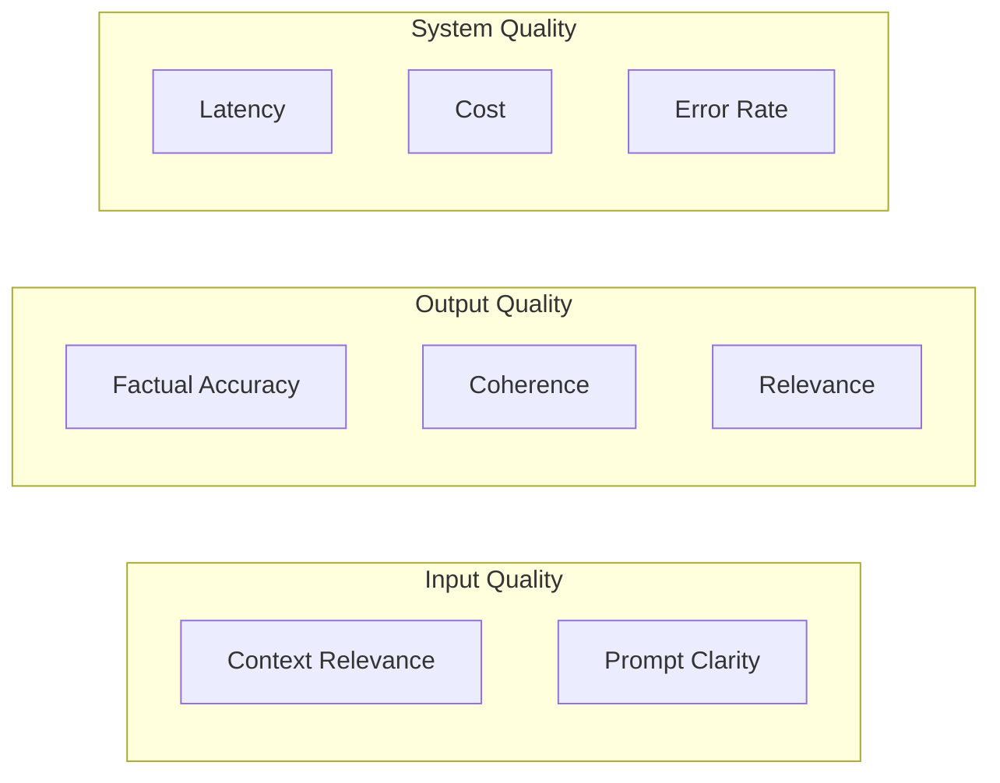
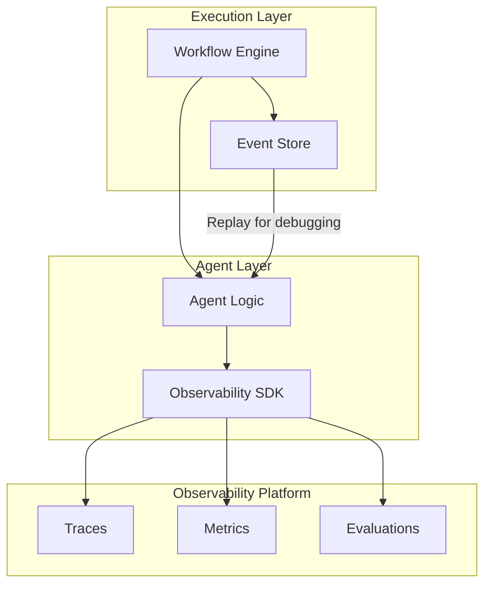

"It worked fine in testing."

Every AI engineer has said these words. The agent that aced your benchmarks fails mysteriously in production. Costs spiral. Users complain about inconsistent behavior. And you're left staring at logs that tell you nothing useful.

The solution isn't better testing—it's observability.

## Why AI Observability Is Different

Traditional application monitoring tracks requests, latencies, and errors. AI observability needs more:

| Traditional APM         | AI Observability           |
| ----------------------- | -------------------------- |
| Request/response timing | Token usage per step       |
| Error rates             | Hallucination detection    |
| Throughput              | Quality scores             |
| Service dependencies    | Model/prompt versions      |
| Transaction traces      | Reasoning chain visibility |

When an agent produces a wrong answer, you need to see:

- Which prompt was used?
- What context was retrieved?
- How did the model reason?
- Where did the chain break down?

## The Observability Stack

After evaluating dozens of tools, three stand out for production use:

### Langfuse: The Full Platform

[Langfuse](https://langfuse.com/) has become the default choice for teams wanting a complete solution. In June 2025, they open-sourced their commercial modules—including LLM-as-a-judge evaluations—under MIT license.

```python
from langfuse import Langfuse
from langfuse.decorators import observe

langfuse = Langfuse()

@observe()
def research_agent(query: str):
    # Automatically traced: inputs, outputs, latency, tokens
    context = retrieve_documents(query)
    response = call_llm(query, context)
    return response

@observe()
def retrieve_documents(query: str):
    # Nested trace - shows parent-child relationship
    embeddings = embed(query)
    docs = vector_search(embeddings)
    return docs
```

**Key features**:

- 78 features across tracing, evaluation, prompt management
- Self-hostable (MIT license)
- Integrations with LangChain, LlamaIndex, OpenAI SDK
- Built-in evaluation frameworks

### Helicone: Scale-First

[Helicone](https://helicone.ai/) processes over 2 billion LLM interactions. Their Cloudflare Workers architecture adds minimal latency (50-80ms) while capturing everything.

```typescript
// One-line integration via proxy
const openai = new OpenAI({
  baseURL: 'https://oai.helicone.ai/v1',
  headers: {
    'Helicone-Auth': `Bearer ${HELICONE_API_KEY}`,
  },
});

// All calls automatically traced
const response = await openai.chat.completions.create({
  model: 'gpt-4o',
  messages: [{ role: 'user', content: 'Analyze this data' }],
});
```

**Key features**:

- Gateway architecture (no SDK changes needed)
- Cost tracking and alerts
- Request caching for cost optimization
- Team-level analytics

### OpenLLMetry: Standards-Based

[OpenLLMetry](https://www.traceloop.com/openllmetry) by Traceloop builds on OpenTelemetry, the industry standard for distributed tracing:

```python
from traceloop.sdk import Traceloop

# Initialize once
Traceloop.init(app_name="my-agent")

# Works with existing OTEL infrastructure
# Export to Jaeger, Grafana, Datadog, etc.
```

**Key features**:

- OpenTelemetry native
- Export to 10+ backends
- No vendor lock-in
- Works with existing observability stack

## What to Measure

Based on production deployments, these metrics matter most:

### Quality Metrics



### The Metrics Dashboard

| Metric               | Target      | Alert Threshold |
| -------------------- | ----------- | --------------- |
| P95 Latency          | Under 5s    | Over 10s        |
| Token cost per query | Under $0.10 | Over $0.50      |
| Retrieval relevance  | Over 0.8    | Under 0.6       |
| User satisfaction    | Over 4/5    | Under 3/5       |
| Hallucination rate   | Under 5%    | Over 15%        |

## Debugging With Traces

When things go wrong, traces are your best friend. Here's a real debugging session:

**Problem**: Agent gives wrong answer about company policy

**Investigation**:

1. Find the trace in Langfuse
2. See retrieval step returned outdated documents
3. Check embedding—query embedded correctly
4. Check vector store—old documents had higher similarity scores
5. **Root cause**: Document update pipeline failed silently

Without observability, this would have been a "model hallucination" ticket. With traces, it's a data pipeline fix.

## The Integration Pattern

The winning architecture combines observability with durable execution:



Key insight: Your observability system should integrate with your execution layer. When you spot a problem in traces, you should be able to replay that exact execution for debugging.

## DuraGraph's Approach

This is why [DuraGraph](/docs/architecture/overview) treats observability as foundational:

- **Event sourcing**: Every state change is an observable event
- **Native Prometheus metrics**: Infrastructure metrics out of the box
- **SSE streaming**: Real-time observation of running workflows
- **Replay capability**: Re-execute any workflow from its event history

Combined with Langfuse or Helicone for LLM-specific traces, you get complete visibility from infrastructure to individual model calls.

## Getting Started

1. **Start with traces**: Add Langfuse or Helicone to capture all LLM calls
2. **Add evaluations**: Use LLM-as-a-judge for automated quality scoring
3. **Build dashboards**: Track the metrics that matter for your use case
4. **Set alerts**: Catch regressions before users do
5. **Integrate with execution**: Connect traces to your workflow events

## Resources

- [Langfuse Documentation](https://langfuse.com/docs)
- [Helicone Quick Start](https://docs.helicone.ai/)
- [OpenLLMetry GitHub](https://github.com/traceloop/openllmetry)
- [DuraGraph Observability Guide](/docs/user-guide/concepts/observability)
