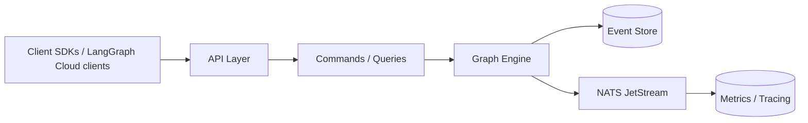

## Mission

DuraGraph provides an **open, extensible orchestration layer** for AI and workflow automation.
Our mission is to enable reliable, observable, and maintainable pipelines that feel natural for developers—bringing the power of LangGraph Cloud to self-hosted and enterprise environments.

## Compatibility with LangGraph Cloud

DuraGraph implements an **API-compatible layer** with **LangGraph Cloud**.
This means:

- Tools, clients, and SDKs built for LangGraph Cloud can run against DuraGraph.
- OpenAPI contracts are aligned for seamless integration.
- Migration and hybrid deployments are supported.

## Architecture

DuraGraph is built on proven technologies for reliability and performance:

- **Event Sourcing** for complete audit trails and state reconstruction
- **CQRS** (Command Query Responsibility Segregation) for scalable reads and writes
- **PostgreSQL** for durable event storage and projections
- **NATS JetStream** for reliable event streaming
- **Custom Graph Engine** for workflow execution with support for conditionals, loops, and human-in-the-loop

This ensures **fault tolerance** and **deterministic execution** for AI-driven processes.

## Target Users

- **AI platform teams** building internal orchestration layers.
- **Enterprises** that require compliance, security, and observability in AI workflows.
- **Open-source contributors** looking for a community-driven orchestration stack.
- **Researchers** who want to run reproducible LangGraph experiments locally.

## Non-Goals

- Providing a custom LLM runtime (we integrate with existing providers).
- Becoming a full-featured cloud platform (our scope is orchestration, not hosting).

## Success Metrics

We measure success by:

- **Adoption**: # of teams using DuraGraph in production.
- **Compatibility**: seamless drop-in replacement for LangGraph Cloud APIs.
- **Reliability**: demonstrated ability to recover from failures without data loss.
- **Community growth**: contributions and RFCs from external developers.

## What's Included

